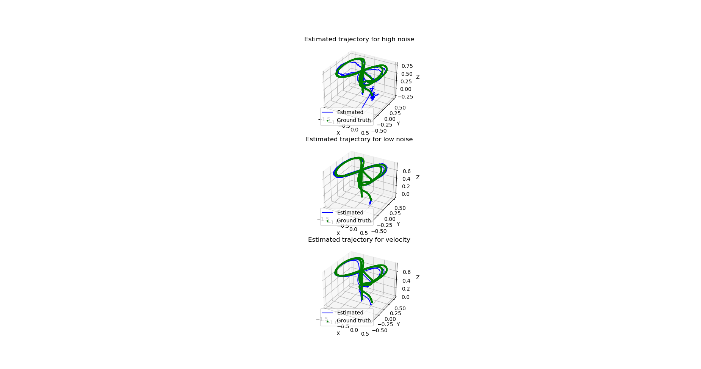

# Kalman Filter

In this repository, we have implemented a Kalman filter to track the motion of a drone flying through open space. The drone's position is monitored by a Qualisys motion capture system, which uses infrared cameras to track spherical retroreflective markers on the drone. The system can capture the drone's motion at a rate of over 100 Hz.

## System Modelling

The system is modeled using a state vector consisting of the drone’s position and velocity. Let **p** = [x, y, z]^T denote the position vector, and **ṗ** = [ẋ, ẏ, ż]^T denote the velocity vector. With this representation, the state vector becomes:

```
x = [x, y, z, ẋ, ẏ, ż]^T
```

The noise is assumed to be zero. Control input vector u(t) is expressed as:

```
u(t) = m * 𝑝̈
```

In this model, we have the input vectors at each timestamp, **u**. Thus, we estimate the acceleration from **u** because of our known model. The Process Model is when we rely on a model. Then we correct our estimate using our sensors or the Measurement model. This is a case of odometry based on physical tracking of the drone.

## Process Model

The state transition model is given by the standard Kalman filter equation:

```
ẋ = A * x + B * u
```

The state transition matrix **A** becomes:

```
A = [ 0  0  0  1  0  0
      0  0  0  0  1  0
      0  0  0  0  0  1
      0  0  0  0  0  0
      0  0  0  0  0  0
      0  0  0  0  0  0 ]
```

The input matrix **B** becomes:

```
B = [ 0   0   0
      0   0   0
      0   0   0
     1/m  0   0
      0  1/m  0
      0   0  1/m ]
```

## Continuous to Discrete

To work with real data, we need to discretize the continuous model. We use Euler's one-step method to discretize:

```
x(t + Δt) = x(t) + Δt * (A * x(t) + B * u(t) + N(t))
```

The state transition matrix **F** is given by:

```
F = I + Δt * A = [ 1   0   0  Δt  0   0
                   0   1   0   0  Δt  0
                   0   0   1   0   0  Δt
                   0   0   0   1   0   0
                   0   0   0   0   1   0
                   0   0   0   0   0   1 ]
```

The input matrix **G** is given by:

```
G = Δt * B = [  0    0    0
                0    0    0
                0    0    0
             Δt/m   0    0
               0  Δt/m   0
               0    0  Δt/m ]
```

## Measurement Model

```
y = C * x + V(noise)
```

Since the sensor here is the IMU, we have a simple observation model.

- If the measurement is position (**z = p**):

```
C_position = [ 1  0  0  0  0  0
               0  1  0  0  0  0
               0  0  1  0  0  0 ]
```

- If the measurement is velocity (**z = ṗ**):

```
C_velocity = [ 0  0  0  1  0  0
               0  0  0  0  1  0
               0  0  0  0  0  1 ]
```

Since the Kalman filter is a discrete filter, we discretize the system using the one-step Euler integration method. The first-order Markov assumption makes the Kalman filter system model a first-order differential equation:

```
ẋ = A * x + B * u + E * N(0, Q)
```

## Kalman Filter

### 1. **P Matrix (Error Covariance Matrix)**
- **Purpose**: Represents the covariance of the error in the estimated state.
- **Role**: Tracks the uncertainty of the state estimate.
- **Dimension**: If the state vector **x** has n dimensions, **P** is an n × n matrix.
- **Key Point**: Diagonal elements represent the variance, and off-diagonal elements represent correlations.

### 2. **Q Matrix (Process Noise Covariance Matrix)**
- **Purpose**: Models the covariance of process noise.
- **Role**: Represents uncertainty in system dynamics. Higher values in **Q** indicate more uncertainty in the model.
- **Dimension**: n × n matrix.
- **Key Point**: If the process model is perfect, **Q** would be zero.

### 3. **R Matrix (Measurement Noise Covariance Matrix)**
- **Purpose**: Describes the covariance of noise in sensor measurements.
- **Role**: Accounts for the noise in sensor data. Higher values in **R** mean the filter relies less on measurements.
- **Dimension**: m × m matrix (where m is the size of the measurement vector).
- **Key Point**: Represents confidence in sensor readings.

### 4. **K Matrix (Kalman Gain Matrix)**
- **Purpose**: Balances the trade-off between model predictions and sensor measurements.
- **Role**: Determines how much of the correction step is influenced by sensor measurements.
- **Key Point**: Used to update the state estimate.

The following equations define the Kalman Filter process:

```
μ̅_t = F * μ_(t-1) + G * u_t
Σ̅_t = F * Σ_(t-1) * F^T + V * Q * V^T
K = Σ̅_t * C^T * (C * Σ̅_t * C^T + R)^(-1)
μ_t = μ̅_t + K * (z_t - C * μ̅_t)
Σ_t = (I - K * C) * Σ̅_t
```

The **Q matrix** is initialized as:

```
Q = σ^2 * (G * G^T)
```

The **P matrix** is initialized with a large value since the initial state is unknown.

The **R matrix** is chosen based on the type of measurement:

```
R = σ^2 * I
```

where **σ** ranges from 0.1 to 1.0 in this case.

## Results
<table>
  <tr>
      <td align = "center">  </td>
  </tr>
  <tr>
      <td align = "center"> Drone Tracking by Kalman Filter </td>
  </tr>
</table>
